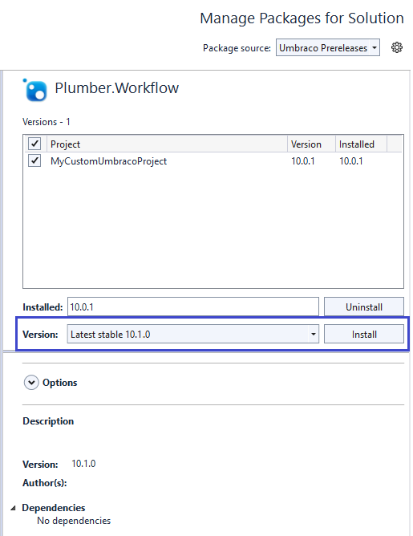

# Upgrading Umbraco Workflow

This article shows how to manually upgrade Umbraco Workflow to run the latest version. Umbraco Workflow displays a prompt in the **Workflow** section when a new version is available.


If you are migrating from Plumber to Umbraco Workflow, see the [Migration from Plumber to Umbraco Workflow](#migration-from-plumber-to-umbraco-workflow) section.


## Get the latest version of Umbraco Workflow

To get the latest version of Umbraco Workflow, you can upgrade using either of the two options:

- [NuGet](#nuget)
- [Visual Studio](#visual-studio)

### NuGet

NuGet installs the latest version of the package when you use the `dotnet add package Umbraco.Workflow` command unless you specify a package version:

  `dotnet add package Umbraco.Workflow --version <VERSION>`

After you have added a package reference to your project by executing the `dotnet add package Umbraco.Workflow` command in the directory that contains your project file, run `dotnet restore` to install the package.

### Visual Studio

- Go to `Tools` -> `NuGet Package Manager` -> `Manage NuGet Packages for Solution...` in Visual Studio, to upgrade Umbraco Workflow:
- Select **Umbraco.Workflow**.
- Select the latest version from the **Version** drop-down and click **Install**.

  

- Open the **<project-name>.csproj** file to make sure the package reference is updated:

  ```xml
  <ItemGroup>
    <PackageReference Include="Umbraco.Workflow" Version="11.x.x" />
  </ItemGroup>
  ```

## Migration from Plumber to Umbraco Workflow

If you are upgrading an Umbraco 10 installation with an existing Plumber installation, follow these steps:




1. Uninstall Plumber and remove the `/App_Plugins/Plumber` folder.
2. Upgrade your project to Umbraco 11. See the [Upgrade your project](../umbraco-cms/fundamentals/setup/upgrading/README.md) article.
3. Install Umbraco Workflow 11. See the [Installing Umbraco Workflow](installing-workflow.md) article.
4. Build the application.


SQL is the preferred database provider for production websites.






1. Uninstall Plumber and remove the `/App_Plugins/Plumber` folder.
2. Upgrade your project to Umbraco 11. See the [Upgrade your project](../umbraco-cms/fundamentals/setup/upgrading/README.md) article.
3. Take a copy of the `Value` column from the `WorkflowSettings` table.
4. Delete the `WorkflowSettings` table.
5. Update `WorkflowTaskInstance` table to allow null values in the GroupId column.
6. Install Umbraco Workflow 11. See the [Installing Umbraco Workflow](installing-workflow.md) article.
7. Build the application.
8. After the migration is completed, update the `WorkflowSettings` table to restore the previous data to the `Value` column.





All your existing workflow data and settings are not affected and will be available on your upgraded site.

