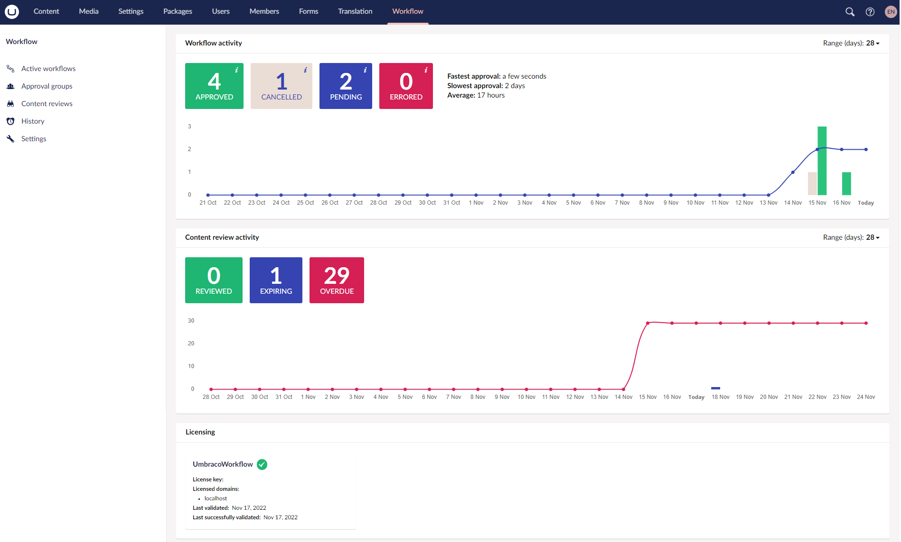
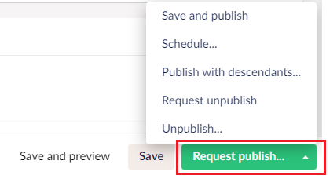
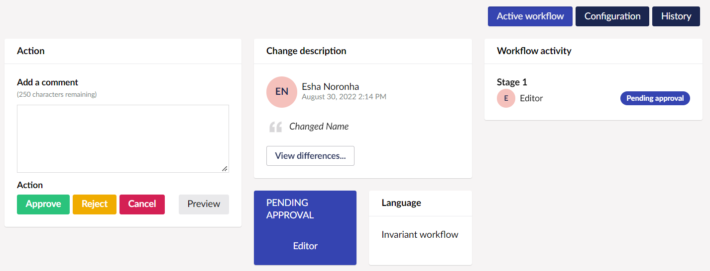
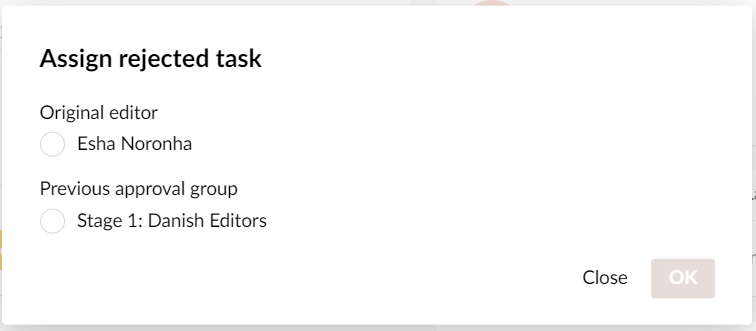
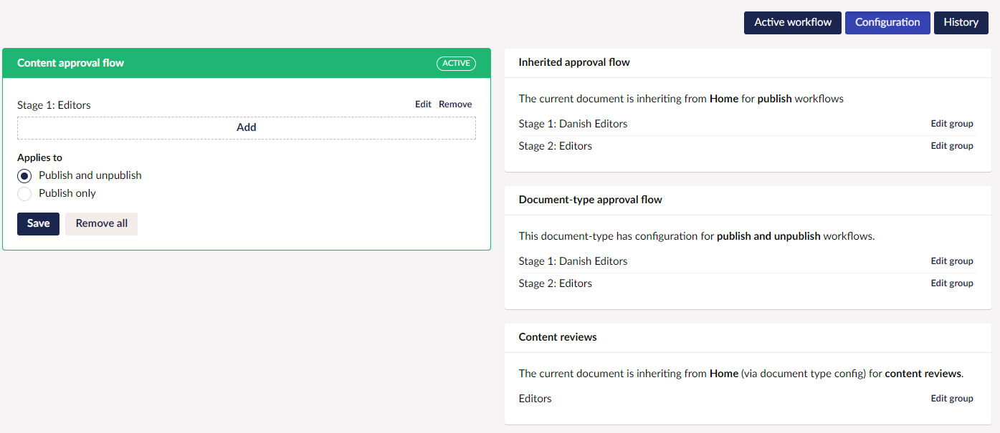
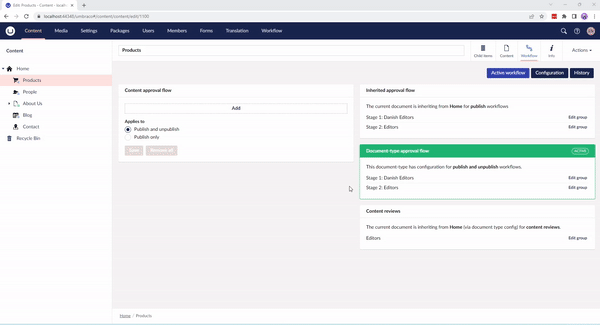
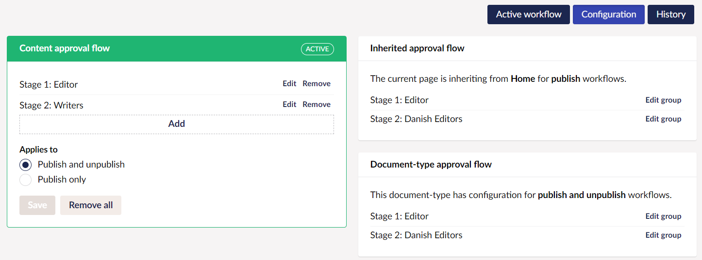
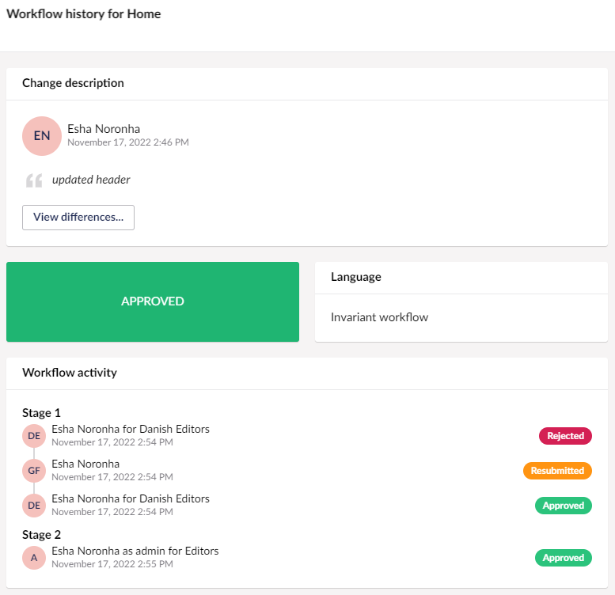

# Workflow in the Content section

Once you install Workflow, you will notice a **Workflow dashboard**  in the **Content** section and a **Workflow Content App** in the content nodes. In this article, we will look at how these features work.

## Workflow Dashboards and Buttons

Umbraco Workflow has its default Dashboards. By default, when you install Umbraco Workflow, you receive two Dashboards: the *User Dashboard* and the *Admin Dashboard*. Additionally, Umbraco Workflow replaces the default Umbraco button set in the editor drawer.

### Dashboards

Umbraco Workflow adds two Dashboards to your Umbraco project:

- **User Dashboard** - This Workflow Dashboard is added in the **Content** section. It displays the tasks requiring approval from the user, current user’s submissions, and stale content (content that needs to be reviewed).

  

- **Admin Dashboard** - This Workflow Dashboard is the default view in the **Workflow** section. It displays a chart of recent workflow activity, chart of content review activity, licensing details, and any relevant upgrade-related messages. You can also view the workflow and content review activity chart for the specified range of days.

  

### Buttons

When a workflow is active on the current node, the **Publish** button is replaced, linking to the workflow content app.

When no workflow is active, the button state is determined by the current user's permissions.

Umbraco Workflow overrides Umbraco's User/Group publishing permissions. If the user has permission to update the node, they will be able to initiate a workflow process on that node. Umbraco Workflow shifts Umbraco from a centrally administered publishing model (controlled by a site administrator) to a distributed model. In this model, editors publish content based on their responsibilities assigned during the workflows.

In cases, where the content is already in a workflow, a notification is displayed at the top of the editor. Depending on the Workflow **Settings**, you can enable/disable editing access on a content node in a workflow.

For nodes where the workflow has been disabled, the default Umbraco options are displayed.

## Workflow Content App

Umbraco Workflow adds a [Content App](https://our.umbraco.com/Documentation/Extending/Content-Apps/) to all content nodes in the **Content** section where a workflow is enabled. The Workflow content app includes three sub-sections:

- [Active workflow](#active-workflow)
- [Configuration](#configuration)
- [History](#history)

### Active Workflow

The Active workflow sub-section provides an interface for managing workflows for the current content node. When you initiate a workflow on the current node, the **Active workflow** sub-section requires information such as:

- Change Description.
- [Optional] Scheduled date to publish the changes requested in the node.

When the current node is pending workflow approval, the **Active workflow** sub-section displays detailed information such as:

- Option to [approve, reject, or cancel pending workflow tasks](#approve-reject-or-cancel-pending-workflow-tasks).
- View change description and track differences across pending and completed workflows.
- View the group responsible for approving the pending workflow.
- View pending language variant(s) workflow.
- View the workflow activity (eg. pending approval/task approvals/rejects) for the current workflow process.

You can access Active Workflows from two places - the **Content** section and the **Workflow** section (depending on your user permission). Workflow Administrators (those users with access to the Workflow section) can access workflows assigned to a different group. In the **Workflow History**, these are noted as being performed by the admin.

In multi-lingual sites, variant content can be submitted in one of these workflows:

- Only the current variant.
- All variants for publishing in a single workflow process using the workflow applied to the default variant.
- Each variant into a separate workflow.

For example, the German version of your content can be approved by German speaker's group and the English version by the English speaker's group.

#### Approve, Reject, or Cancel pending workflow tasks

**Approve Workflow Tasks**

To approve a Workflow task, click on the **Approve** button in the Action section.

**Reject Workflow Tasks**

To reject a Workflow task, click on the **Reject** button in the Action section. Depending on the approval stage, the reviewer can decide where to send the rejected task.

For first-stage approvals, the rejected task is sent back to the original editor/author. For second-stage approvals and above, the reviewer can send the rejected task either to the original editor or any other previous workflow group.

**Cancel pending Workflow Tasks**

To cancel a pending Workflow task, click on the **Cancel** button in the Action section.

### Configuration

The Configuration sub-section provides an interface for configuring the content approval flow for the current node. It also displays any Inherited or Document type approval flows applied to the current content node.

#### Content Approval Flow

You can add different groups for different stages of content approval flow. Content Approval flow groups can be reordered via drag and drop. You can also apply the approval flow either for publish and unpublish workflow or only publish workflow.

#### Approval Flow Types

Approval Flows are available in three types: Content approval flow, Inherited approval flow, and Document type approval flow.

A given content node may have all three approval flow types applied but only one will be applied as per the following order of priority:

- **Content approval flow:** set directly on a content node via the **Configuration** section in the **Workflow** tab . This type will take priority over all others.
- **Document type approval flow:** set in the **Settings** section. This approval flow will apply to all content nodes of the selected Document Type unless the node has a Content approval flow set. This feature requires a license.
- **Inherited approval flow:** if a node has no Content approval flow set, nor a flow applied to its Document Type, Umbraco Workflow will traverse the content tree until it finds a node with a Content approval flow and will use this flow for the current change.

Review the current responsibilities for Approval Groups in the **Roles** tab of the **Approval Groups** section for **Node-based approvals** and **Document type approvals** only. For more information see the [Roles](approval-groups.md#roles) section in the [Approval Groups](approval-groups.md) article.

Document type approval flows can also include conditional stages i.e., only include **Translators** in the workflow when the **Description** property has changed. For more information on settings conditions in Document type approval flows, see the [Document type approval flows](workflow-settings.md#document-type-approval-flows) section in the [Workflow Settings](workflow-settings.md) article.


Configuration cannot be modified when a content node is in a workflow process.


#### Content reviews

Content reviews is a tool that allows content editors to keep their content up-to-date. For more information, see the [Content reviews](content-reviews.md) section.

### History

The History sub-section provides a chronological audit trail of workflow activity for the current node. It displays a table containing the following information:

- Type of Publish.
- Who the workflow is requested by.
- The date the workflow was requested.
- Comments.
- Status of the workflow.

You can also **Filter** the records based on the information listed above. Additionally, you can adjust the total number of records displayed on a page.

The **Detail** button at the end of the record displays an overlay with content similar to the Active workflow sub-section.

