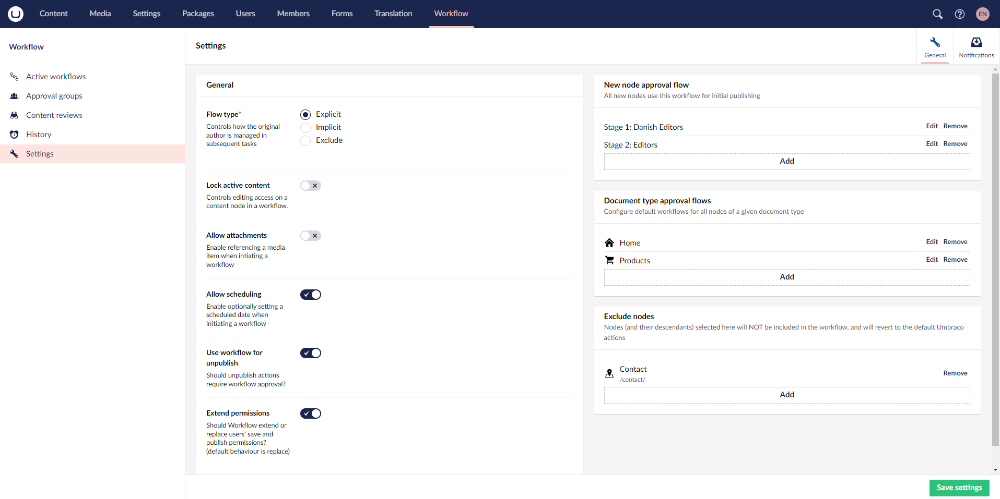
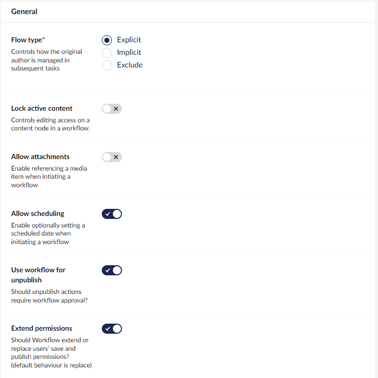
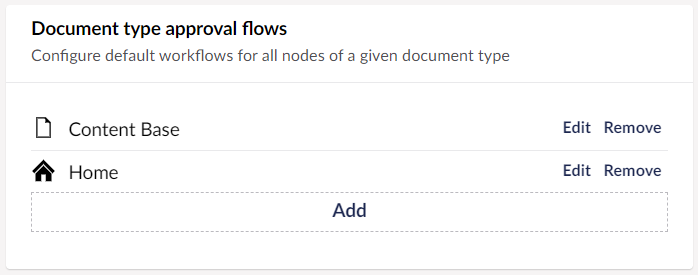
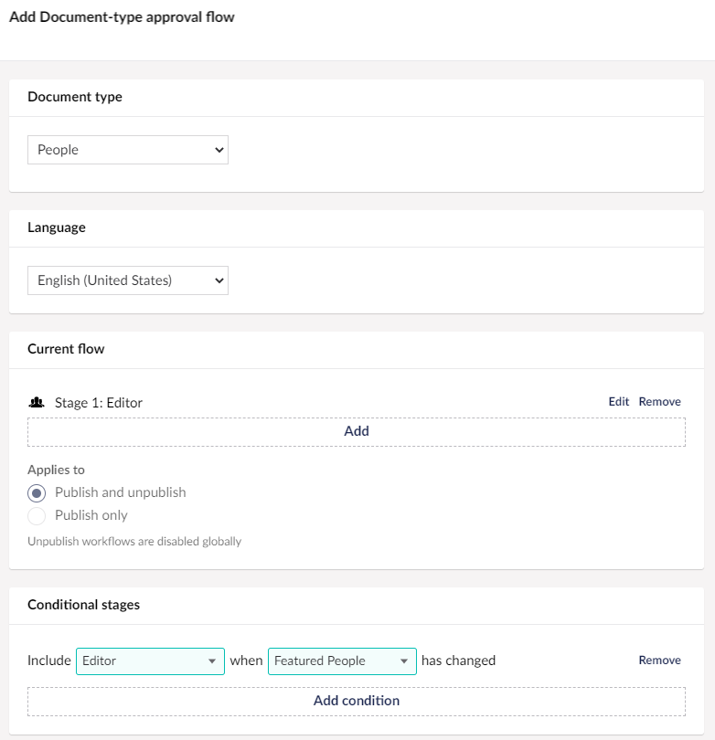
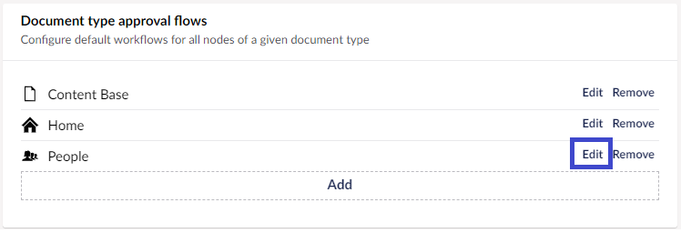
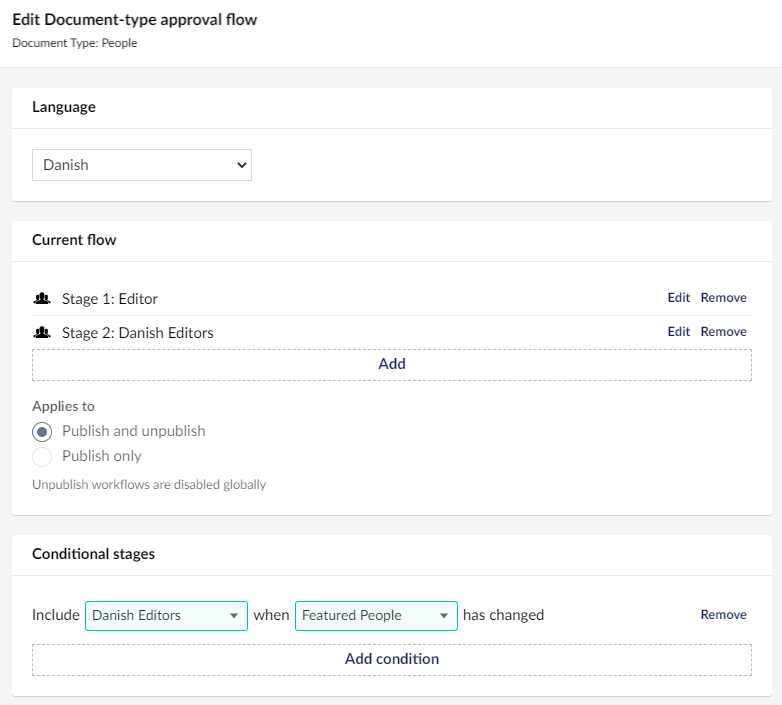
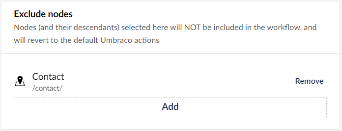
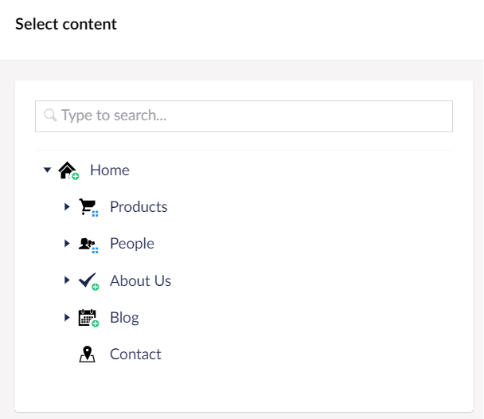

# Umbraco Workflow Settings

When working with Umbraco Workflow, you can handle the workflow settings directly in the Backoffice from the **Workflow** section. You can configure general workflow settings, new node approval flows, Document type approval flows, and exclude nodes.

## General Settings

You can configure the **General** Settings from the **Workflow** section in the **Settings** menu. The following settings are available:

- **Flow type** - Determines the approval flow progress. These options manage how the Change Author is included in the workflow:
  - **Explicit** - All steps of the workflow must be completed and all users will be notified of tasks (including the Change Author).
  - **Implicit** - All steps where the original Change Author is NOT a member of the group must be completed. Steps where the original Change Author is a member of the approving group will be completed automatically and noted in the workflow history as not required.
  - **Exclude** - Similar to Explicit. All steps must be completed but the original Change Author is not included in the notifications or shown in the dashboard tasks.
- **Lock active content** - Determines how the content in a workflow should be managed. Set to `true` or `false` depending on whether the approval group responsible for the active workflow step should make modifications to the content.
- **Allow attachments** - Provide an attachment (such as a supporting document or enable referencing a media item) when initiating a workflow. This feature is useful when a workflow requires supporting documentation.
- **Use workflow for unpublish** - Determines if unpublish actions require workflow approval.
- **Extend permissions** - Determines if Umbraco Workflow should extend or replace the users' save and publish permissions. The default behavior is to replace the users' permissions.

## New node approval flow

All new nodes use this workflow for initial publishing. You can add, edit, or remove an approval group to/from the workflow.

To add an approval group to the workflow:

1. Go to the **Workflow** section.
2. Go to the **General** tab in the **Settings** menu.
3. Click **Add** in the **New node approval flow** section.
  

4. Select an **approval group** to add to the workflow.
  

5. Click **Submit**.
6. Click **Save Settings**.

When you click on the **Edit** approval group, you are presented with different configuration options for that group. For more information on the approval group settings, see the [Settings](approval-groups.md#settings) section in the [Approval Groups](approval-groups.md) article.

## Document type approval flows

Configure default workflows that should be applied to all content nodes of the selected Document Type. This feature requires a license.

To add a Document type approval flow:

1. Go to the **Workflow** section.
2. Go to the **General** tab in the **Settings** menu.
3. Click **Add** in the **Document type approval flows** section.
  

4. Select a **Document type** from the drop-down list.
  

5. Select a **Language** from the drop-down list.
6. **Add workflow approval groups** in the **Current flow** process.
7. Click **Add condition** to add a condition to the workflow process.
  

8. Click **Submit**.
9. Click **Save Settings**.

To edit a Document type approval flow:

1. Go to the **Workflow** section.
2. Go to the **General** tab in the **Settings** menu.
3. Click **Edit** next to the content node in the **Document type approval flows** section.
  

4. Select a **Language** from the drop-down list.
5. **Add**, **Edit**, or **Remove** approval groups from the current workflow.
6. Click **Add condition** to add a condition to the workflow process.
  

7. Click **Submit**.
8. Click **Save Settings**.

## Exclude nodes

Nodes and their descendants selected here are excluded from the workflow process and will be published as per the configured Umbraco user permissions. This feature requires a license.

To exclude a node from the workflow process:

1. Go to the **Workflow** section.
2. Go to the **General** tab in the **Settings** menu.
3. Click **Add** in the **Exclude nodes** section.
  

4. Select the **Content node** from the Content tree.
  

5. Click **Submit**.
6. Click **Save Settings**.
